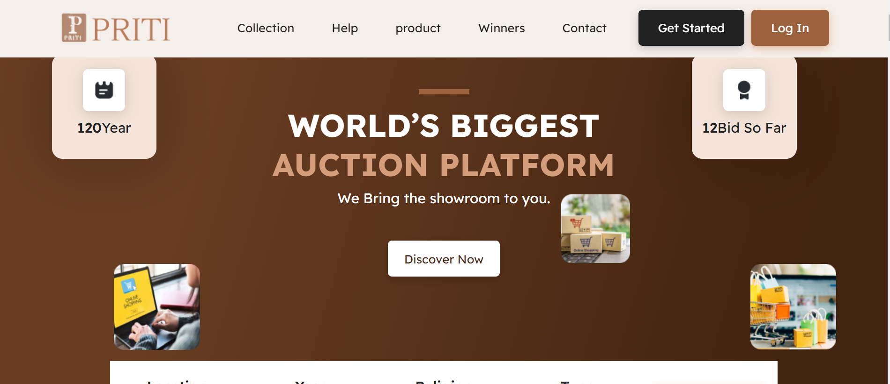
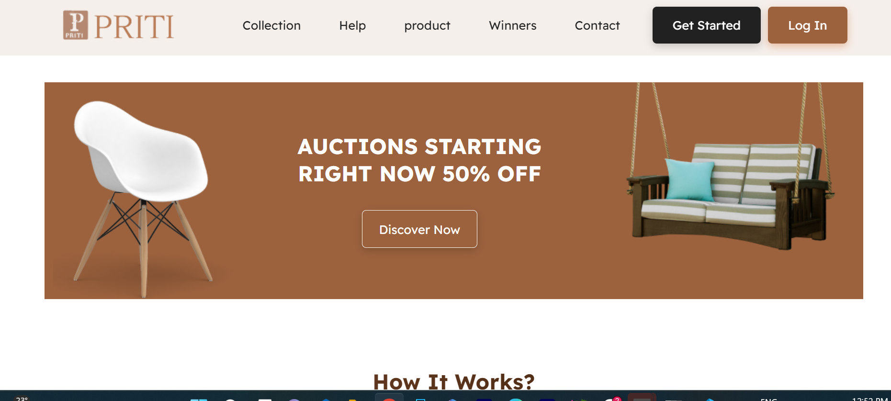
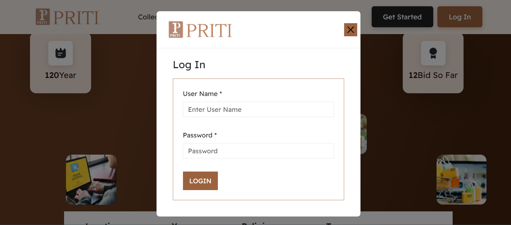
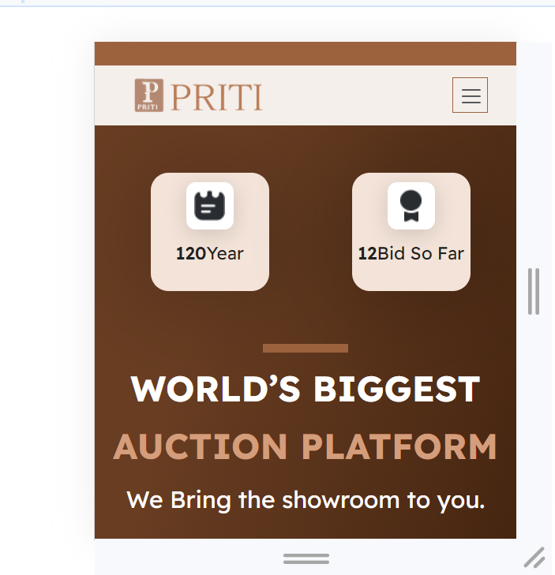

# priti
# Description

This application is based on furniture where you can see differnet types of furniture and price and purchase it.Developed an interactive education website, using HTML, CSS, and JavaScript

* [GitHub Repository](https://github.com/LipikaManglaa/priti)
* [Deployed GitHub IO]  git@github.com:LipikaManglaa/priti.git

## Table of Contents

  
* [Description](#Description)

* [Technologies-Used](#Technologies-Used)

* [Installation](#installation)

* [Screenshots](#Screenshots) 
  
* [Instructions](#Instructions) 
          
* [Questions](#questions)
 
* [License](#license)  

### Technologies-Used
  *
  *HTML
  *CSS
  *JAVASCRIPT
 
 ### Screenshots

 Home Screen
   

 Auction Screen
   
   
 Login Screen
   

 Mobile Responsive
   

### Installing

* To install this code, download the zip file, or use GitHub's guidelines to clone the repository. 

## Instructions
If you would like to see how to create Ecommerce API then you can check my github repo and let you know  how to cretae it

## License
This application is covered under the MIT license

## Questions
Created by: LipikaManglaa

If you have any further questions please feel free to contact me at lipika.mangla.web@gmail.com
